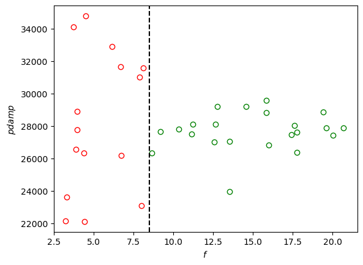

# set-berendsen-pdamp

The response in the pressure due to the [Berendsen barostat](http://www.sklogwiki.org/SklogWiki/index.php/Berendsen_barostat) is related to the bulk modulus ([compressibility](http://www.sklogwiki.org/SklogWiki/index.php/Compressibility#Isothermal_compressibility)). For the [press/berendsen fix](https://docs.lammps.org/fix_press_berendsen.html) in [LAMMPS](https://www.lammps.org/#gsc.tab=0), you can either compute the bulk modulus of your system and use the modulus keyword and pdamp or use the default value of modulus and set pdamp to get the desired response.

This package automatically sets pdamp for the Berendsen barostat in LAMMPS by fitting to a target time to get to the set point pressure, $t_{target}$. For a given value of pdamp, the pressure versus time data is fit to:

$$ P = P_0 \exp(-t/\tau) + P_{set} (1 - \exp(-t/\tau)) $$

$P$: pressure  
$t$: time  
$P_{set}$: set point pressure  
$P_0$: initial pressure (adjustable in fit)  
$\tau$: time constant (adjustable in fit)  
$t_{set} = -\tau \ln(0.01)$ (99% of the way from $P_0$ to $P_{set}$)

The value of pdamp is chosen so that $t_{set} \approx t_{target}$. In the absence of noise or any systematic errors in fitting, pdamp is linearly related to $t_{target}$, so only a few short simulations are required.

## Installation

### This package

Until a package is available and assuming git and conda are already installed:

```shell
git clone https://github.com/bnovak1/set-berendsen-pdamp
cd set-berendsen-pdamp
conda env create -f environment.yml -n set_berendsen_pdamp
conda activate set_berendsen_pdamp
pip install .
```

Note that pylammpsmpi and LAMMPS are also requirements (not in environment.yml), but how they are installed may depend on what LAMMPS packages you need. See the next section.

### LAMMPS & pylammpsmpi

If you don't need any extra LAMMPS packages and you are using conda, then installing [pylammpsmpi](https://pylammpsmpi.readthedocs.io/en/latest/installation.html) will also install LAMMPS.

```shell
conda install pylammpsmpi -c conda-forge
```

Installing pylammpsmpi using pip will not install LAMMPS. If you are using pip for all of your python packages, then you must compile LAMMPS yourself even if you don't need any extra LAMMPS packages.

```shell
pip install pylammpsmpi
```

If you need any extra LAMMPS packages, you must compile LAMMPS yourself and use pip to install pylammpsmpi. LAMMPS must be installed as a library and with the python module. The [calphy package documentation](https://calphy.org/en/latest/gettingstarted.html) explains how to do this. Also, see the [LAMMPS documentation for installing with the python module](https://docs.lammps.org/Python_install.html). Note that you should install any other LAMMPS packages you need using additional `-D` flags with the `cmake` command.

### Singularity

Instead of installing LAMMPS yourself, you could use the Singularity image used in the tests if it meets your requirements or modify the .def file in the container directory and build your own Singularity image. The image for the tests uses Ubuntu 22.04, LAMMPS with some extra packages installed including MANYBODY, and necessary Ubuntu and python packages. See the .def file in the container directory for details. To download the Singularity image, use the following command:

```shell
singularity pull container/python_3.11_lammps_29aug2024.sif library://jaglion/set_berendsen_pdamp/python_3.11_lammps_29aug2024
```

The image used in the tests was built with SingularityCE 4.0.2. SingularityCE releases can be downloaded from [here](https://github.com/sylabs/singularity/releases).

## Usage

### Inputs

#### JSON input file

Inputs must be provided in a JSON file. See examples/Ni_EAM_solid/input/config.json for an example. The following keys are required:

* CORES: The number of cores to use for the simulation(s).
* TSTART: The temperature in LAMMPS units.
* PSET: The set point pressures in LAMMPS units. This should be a list of two numbers regardless of the number of simulation stages, but the first number will be ignored if you are only simulating stage 2. See the section on LAMMPS input file(s) below for more details on stages.
* SIM_TIME_STAGE2: The simulatin time in LAMMPS units for stage 2. See the section on LAMMPS input file(s) below for more details on stages.
* PDAMP_INITIAL: Initial guess for pdamp. Currently, guesses that are way too high can be dealt with in stage 2, but your pressure may not reach the set point in stage 1 if you are using a Berendsen barostat there. If that happens, your initial pressure for stage 2 could be too close to the set point pressure for stage 2 and you will need to lower your guess and restart from stage 1. This is not a problem if you are simulating stage 2 only or not using a Berendsen barostat in stage 1. The code will warn you or throw an error if your initial pressure is too close to your set point pressure in stage 2. Guesses that are way too low may cause problems, and there are no checks or fixes currently implemented for that case. Therefore, it is best to start with a high guess if you are unsure. See the section on LAMMPS input file(s) below for more details on stages.
* T_TARGET: Desired time for pressure to get 99% of the way from $P_0$ to $P_{set}$ in LAMMPS units.
* DT_TOL: Tolerance for stopping the simulation. Stop when $dt = \left|t_{set} - t_{target}\right| <$ DT_TOL.
* INDIR: Name of the Directory containing the LAMMPS input file(s). The input files include the LAMMPS input file(s), POTENTIAL_file, and optionally stage1.data which is used to start stage 2. See the section on LAMMPS input file(s) below for more details on stages. 
* POTENTIAL_FILE: Name of the file to be included in the LAMMPS input file(s) that defines the potential function(s) for the interactions between atoms. This file must be in INDIR. See examples/Ni_EAM_solid/input/potential.lmp for an example.
* LAMMPS_INPUT
    * STAGE2
        * TEMPLATE: Name of the LAMMPS input file template for stage 2. This file must be in INDIR. See examples/Ni_EAM_solid/input/stage2_template.lmp for an example. See the section on LAMMPS input file(s) below for more details.
        * INPUT: Name of the LAMMPS input file for stage 2. This file will be created from the template and written to INDIR. See the section on LAMMPS input file(s) below for more details.
* OUTDIR: Name of directory to write output files to. This directory will be created if it does not exist.

The following keys are not required if not simulating stage 1 (see the section on LAMMPS input file(s) below for more details on stages):

* LAMMPS_INPUT
  * STAGE1: 
    * TEMPLATE: Name of the LAMMPS input file template for stage 1. This file must be in INDIR. See examples/Ni_EAM_solid/input/stage1_template.lmp for an example. See the section on LAMMPS input file(s) below for more details.
    * INPUT: Name of the LAMMPS input file for stage 1. This file will be created from the template and written to INDIR. See the section on LAMMPS input file(s) below for more details.

#### LAMMPS input file(s), stage1.data

To estimate $t_{set}$, a starting configuration with a significantly different pressure is needed. This can either be provided as a data file named stage1.data placed in INDIR or a separate simulation (stage 1) can be run to generate stage1.data. If stage 1 is run, it must output stage1.data into INDIR. Then the stage 2 simulation must read stage1.data. See examples/Ni_EAM_solid/input/stage1.lmp for an example of a LAMMPS input file for stage 1. See examples/Ni_EAM_solid/input/stage2.lmp for an example of a LAMMPS input file for stage 2.

The LAMMPS input file(s) are generated from template files. The template files are the same as the LAMMPS input files except that the following keywords are replaced with values from the JSON input file: [TSTART], [PSET], [SIM_TIME], [PDAMP_INITIAL], [POTENTIAL_FILE]. The names in [] mostly match the keys from the JSON input file section above. The exception is [SIM_TIME] which is replaced with the value for the SIM_TIME_STAGE2 key from the JSON file. [PSET] is replaced with the first value in the list from the JSON input file for stage 1, and with the second value in the list for stage 2. Only [PDAMP_INITIAL] is strictly required in the template file(s), but using [TSTART], [PSET], and [SIM_TIME] is advised. Obviously, the temperature in stage 1 and stage 2 must be the same, so it is advisable to use [TSTART] in both template files. The set point pressure used in the stage 2 simulation must be the same as the value in the JSON file since the fitting treats it as a constant obtained from the JSON file. The simulation time in stage 2 must match the value of SIM_TIME_STAGE2 in the JSON file since the simulation time from the JSON file is compared to $t_set$ initially to determine if the simulation should be restarted with a smaller value of pdamp. pdamp is halved until $t_set$ < SIM_TIME. [LOG_FILE] can be used in the template files, but it is not required. If it is used, it will be replaced with OUTDIR/stage1.log for stage 1 and OUTDIR/stage2.log for stage 2. It is advisable to use [DATA_FILE] where writing and reading stage1.data. If it is present it will be replaced with INDIR/stage1.data. It is required that the input file for stage 2 writes the time and pressure to a file named OUTDIR/pressure2.dat. It is advisable to write a similar file for stage 1. If [PRESSURE_FILE] is used in the template file(s), it will be replaced with OUTDIR/pressure1.dat for stage 1 and OUTDIR/pressure2.dat for stage 2. The following lines are examples of how to write the time and pressure to a file in LAMMPS template files:


```
variable        t equal time
variable        p equal press
fix             writepressure all print 10 "$t $p" &
                    file [PRESSURE_FILE] screen no
```

The template files must be in INDIR. The LAMMPS input files are written to INDIR. Examples of template files are provided in examples/Ni_EAM_solid/input/stage1_template.lmp and examples/Ni_EAM_solid/input/stage2_template.lmp.

#### Choosing set point pressure(s)

The first consideration when choosing set point pressure(s) is that you should avoid phase transitions. If stage 1 and stage 2 end in different phases, then the value of pdamp you obtain will not be reasonable. Second, the set point pressures for stage 1 and stage 2 should be chosen so that $\left|P_0 - P_{set}\right|$ in stage 2 is significantly larger than the pressure fluctuations. If that is not the case, then the resulting value of pdamp will be less accurate or it will take a very long time for pdamp to converge. The following plot is the ratio $\left|P_0 - P_{set}\right|$ to the standard deviation of the pressure for times greater than $t_set$ ($\sigma_P$). $\sigma_P$ was chosen to represent the pressure fluctuations. This ratio is given the symbol $f$: $f=\frac{\left|P_0 - P_{set}\right|}{\sigma_P}$.



The green points represent "good" values of $f$ where pdamp does not vary too much. It varies mostly due to noise. The red points where $f$ is smaller show higher variance since the signal starts to become less dominant relative to the noise. For values of $f$ approaching 2.5, convergence becomes difficult so values smaller than 2.5 are not realistic. The code estimates $f$ and prints a warning if $2.5 < f < 10$ and throws an error if $f < 2.5$. Note that convergence may be difficult for $f$ close to 2.5 and that the estimation of $f$ is less accurate when it is smaller. If it requires more than a few simulations for convergence, you should probably increase the difference in the values of PSET for stage 1 and stage 2. If that is not possible without leading to a phase transition, then you will have to increase your system size to reduce the pressure fluctuations.

### Python script

```python
from set_berendsen_pdamp import SetBerendsenPdamp
set_pdamp = SetBerendsenPdamp('examples/Ni_EAM_solid/input/config.json')
set_pdamp()
```

### Command line

```shell
python set_berendsen_pdamp.py examples/Ni_EAM_solid/input/config.json
```
