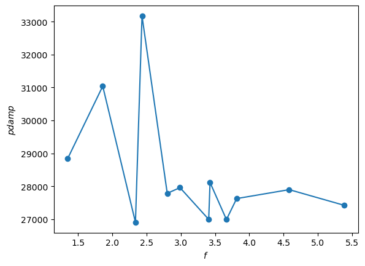

# set-berendsen-pdamp

The response in the pressure due to the [Berendsen barostat](http://www.sklogwiki.org/SklogWiki/index.php/Berendsen_barostat) is related to the bulk modulus ([compressibility](http://www.sklogwiki.org/SklogWiki/index.php/Compressibility#Isothermal_compressibility)). For the [press/berendsen fix](https://docs.lammps.org/fix_press_berendsen.html) in [LAMMPS](https://www.lammps.org/#gsc.tab=0), you can either compute the bulk modulus of your system and use the modulus keyword and pdamp or use the default value of modulus and set pdamp to get the desired response.

This package automatically sets pdamp for the Berendsen barostat in LAMMPS by fitting to a target time to the set point pressure, $t_{target}$. For a given value of pdamp, the pressure versus time data is fit to:

$$ P = P_0 * \exp(-t/\tau) + P_{set} * (1 - \exp(-t/\tau)) $$

$P$: pressure  
$t$: time  
$P_{set}$: set point pressure  
$P_0$: initial pressure (adjustable in fit)  
$\tau$: time constant (adjustable in fit)  
$t_{set} = -\tau * \ln(0.01)$ (99% of the way from $P_0$ to $P_{set}$)

The value of pdamp is chosen so that $t_{set} \approx t_{target}$. In the absence of noise or any systematic errors in fitting, pdamp is linearly related to $t_{target}$, so only a few short simulations are required.

## Installation

### This package

### LAMMPS

LAMMPS must be installed as a library and with the python module. The [calphy package documentation](https://calphy.org/en/latest/gettingstarted.html) explains how to do this. Note that you should install any extra LAMMPS packages you need using additional `-D` flags with the `cmake` command.

### pylammpsmpi

pylammpsmpi is not listed as a requirement for this package since it should be installed after LAMMPS.

```shell
pip install pylammpsmpi
```

## Usage

### Inputs

#### JSON input file

#### LAMMPS input file(s), stage1.data

#### Choosing set point pressure(s)



$f=\frac{\left|P_0 - P_{set}\right|}{\left(-\min\left(P - P_{set} | t>t_{set}\right)+\max(P - P_{set} | t>t_{set}\right)/2}$

### Python script

```python
from set_Berendsen_Pdamp import SetBerendsenPdamp
setter = SetBerendsenPdamp('./config.json')
setter()
```

### Command line

```shell
python set_Berendsen_Pdamp.py ./config.json
```
